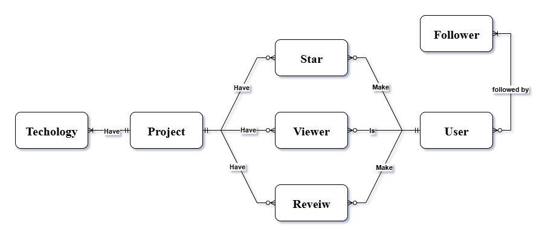

# DevHub Application

#### Video Demo: [Watch here](https://youtu.be/BZ5xcTF5dFM)

---

### Description
DevHub is a portfolio platform where developers can showcase their work by telling the full story behind each project. It goes beyond a simple code repository, allowing users to create detailed case studies complete with video demos, architectural diagrams, and personal reflections on their key learnings.

---

### Distinctiveness and Complexity
DevHub integrates concepts and functionalities from previous CS50 projects into a unified platform designed for portfolio management and professional community engagement. Unlike the Wiki project, DevHub is not a knowledge repository but a structured environment for developers to present their work and technical competencies. In contrast to Mail, its emphasis lies on project presentation rather than communication. Unlike E-commerce, DevHub is not oriented toward transactions but toward professional showcasing. Finally, while it incorporates certain social elements from Network, it does not function as a full-scale social networking site.

From a technical perspective, DevHub demonstrates substantial complexity through the integration of multiple Django models **User**, **Project**, **Review**, and **Technology** which are interconnected using several Many-to-Many relationships to ensure scalability and data consistency. The application also employs custom JavaScript functions. These functions enable asynchronous operations, including project starring, review submission, project deletion, user image updates, visibility toggling, and follow/unfollow interactions, thereby enhancing responsiveness and user experience.

---

### Apps
- **Accounts:** Handles user authentication, Dashboard management.
- **Projects:** Manages project creation, updates, reviews, and interaction mechanisms.  

---

### Accounts App

**Models**: Include User entity with:
  - Extends Django’s `AbstractUser`
  - Additional fields: `photo` (profile image).
  - Many-to-many self-relationship for followers/following
  - Includes serializer method for API responses

**Views**: Include user-related views:
- `login_view`: Authenticates users  
- `logout_view`: Terminates sessions  
- `register`: Creates new accounts
- `dashboard`: Displays user profiles with their projects and following status  
- `update_photo`: AJAX endpoint for profile photo uploads  
- `follow`: Toggles follower relationship  

**URLs**: Include user-related URLs:
- Routes defined for authentication (login, logout, register), user profiles (dashboard), and API endpoints (follow, update_photo).

**Tests**: Include user-related tests:
- test valid followers

**Templates**: Include user-related templates:
- `login.html`: Authentication form with Bootstrap styling  
- `register.html`: User registration with validation  
- `dashboard.html`: User profile with projects

---

### Projects App

**Models**: Include project-related models:
- `Project`: Detailed Project created by a user
- `Technology`: Represents programming languages used in projects 
- `Review`: users review on a project

**Views**: Include project-related views:
- `index`: Displays feed of public projects with pagination feature
- `create`: Handles new project submissions
- `update`: Modifies existing projects  
- `delete`: Removes projects  
- `detail`: Shows project info and reviews  
- `reviews`: AJAX endpoint for adding reviews  
- `stars`: Handles starring/unstarring  
- `visibility`: Toggles public/private status  

**URLs**: Include project-related URLs:
- URL patterns for all project functionality and AJAX operations.

**Forms**: Include project-related forms:
- `ProjectForm`: a form that handles input validation for both create and update operations, built from our project entity model.

**Tests**: Include project-related tests:
Validates:
- Review submission  
- Starring functionality  
- Authorization checks  

**Templates**: Include project-related templates:
- `index.html`: Responsive project feed  
- `create.html` / `update.html`: Submission forms  
- `detail.html`: The core template that shows the user's project details in a structured way

**Script.js**: Include project-related JavaScript:
- Manages all AJAX interactions and dynamic UI updates

---

### How to Run the Application
- **python install -r requirements.txt**
- **python manage.py makemigrations**
- **python manage.py migrate**
- **python manage.py runserver**
